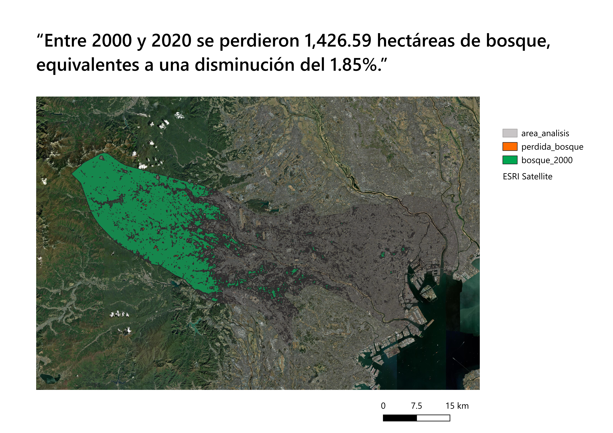

# Expansión urbana y pérdida de bosque en Tokio

### ¿Cuánto creció la ciudad y qué pasó con las áreas boscosas?

Entre 2000 y 2020, el área urbana aumentó en **4,186 ha**, pasando de 92,900 a 97,086 ha, lo que representa un crecimiento del **4.51%**. Durante el mismo período, las áreas boscosas disminuyeron en **1,426.59 ha (1.85%)**. Además, **1,421.81 ha de pérdida de bosque** se localizaron dentro de las nuevas áreas urbanas.

## Mapas

### Capa: área_análisis
- **Fuente:** Simple Maps
- **Versión/Tesela:** No posee una versión como tal o una tesela ya que es un mapa de Japón completo
- **URL:** https://simplemaps.com/gis/country/jp
- **Licencia:** Creative Commons Attribution 4.0 (CC BY 4.0)
- **CRS original:** WGS 84 (EPSG:4326)

### Capa: lossyear40130
- **Fuente:** Hansen
- **Versión/Tesela:** Versión 1.13 // 30–40°N, 130–140°E
- **URL:** https://storage.googleapis.com/earthenginepartners-hansen/GFC-2025-v1.13/Hansen_GFC-2025-v1.13_lossyear_40N_130E.tif
- **Licencia:** Creative Commons Attribution 4.0 International License (CC BY 4.0)
- **CRS original:** WGS 84 (EPSG:4326)

### Capa: WorldCover (treecover 2000)
- **Fuente:** ESA WorldCover
- **Versión/Tesela:** WorldCover V2 2021 — ESA_WORLDCOVER_10M_2021_V200_N33E138_MAP
- **URL:** https://stac.terrascope.be/collections/esa-worldcover-map-10m-2021-v2/items?&collections=esa-worldcover-map-10m-2021-v2&sortby=properties.datetime,id&bbox=127.42686286090436,31.22907831881902,145.70166680967142,38.40714236607312
- **Licencia:** Creative Commons Attribution 4.0 International License (CC BY 4.0)
- **CRS original:** WGS 84 (EPSG:4326)

### Capa: 2000 layer
- **Fuente:** Emergency Management Service (GHSL)
- **Versión/Tesela:** R2023A // R5_C31, R6_C31, R6_C32, R7_C32
- **URL:** https://human-settlement.emergency.copernicus.eu/download.php?ds=bu
- **Licencia:** Creative Commons Attribution 4.0 International (CC BY 4.0)
- **CRS original:** World Mollweide (ESRI:54009)

### Capa: 2020 layer
- **Fuente:** Emergency Management Service (GHSL)
- **Versión/Tesela:** R2023A // R5_C31, R6_C31, R6_C32, R7_C32
- **URL:** https://human-settlement.emergency.copernicus.eu/download.php?ds=bu
- **Licencia:** Creative Commons Attribution 4.0 International (CC BY 4.0)
- **CRS original:** World Mollweide (ESRI:54009)

## Resultados del análisis 2000–2020

| Variable | 2000 | 2020 | Δ ha | Δ % |
|---|---:|---:|---:|---:|
| Urbano (ha) | 92,900 | 97,086 | +4,186 | +4.51% |
| Bosque (ha) | 77,149.26 | 75,722.67 | −1,426.59 | −1.85% |

## Cambios detectados

| Máscara | Celdas | Superficie (ha) |
|---|---:|---:|
| Urbano nuevo | 7,997 | 7,997 |
| Pérdida de bosque | 15,851 | 1,426.59 |

## Conteo de celdas

### Urbano
- Urbano 2000: 92,900 celdas
- Urbano 2020: 97,086 celdas
- Urbano nuevo: 7,997 celdas

### Bosque
- Bosque 2000: 857,214 celdas
- Bosque 2020: 841,363 celdas
- Pérdida de bosque: 15,851 celdas

### Resolución
- Urbano (GHSL): 100 × 100 m = 1 ha por celda
- Bosque (Hansen): 30 × 30 m = 0.09 ha por celda

### Cruce urbano-bosque

Se utilizó **Zonal Statistics (Sum)** para cruzar `urbano_nuevo` con `perdida_bosque`. Se obtuvieron **15,798 píxeles** de pérdida de bosque dentro de las nuevas zonas urbanas. A **0.09 ha por píxel**, esto equivale a **1,421.82 ha de bosque perdido**.

